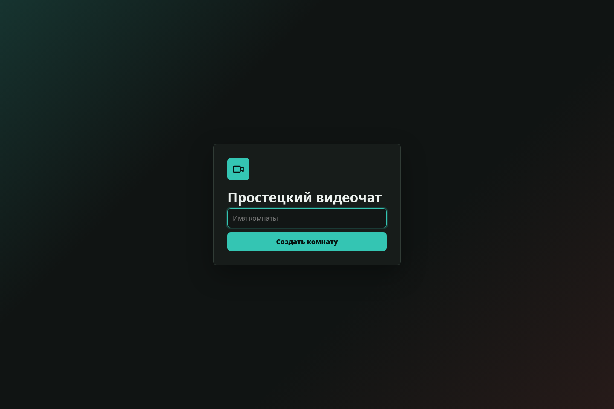
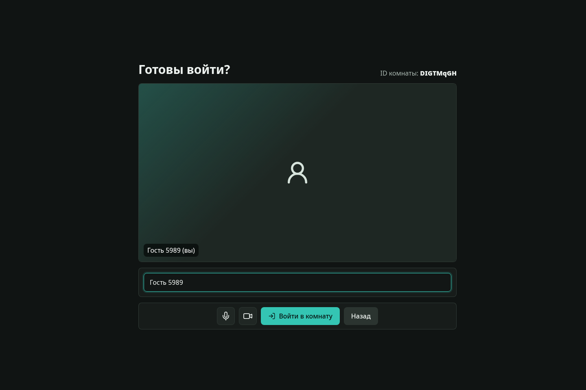
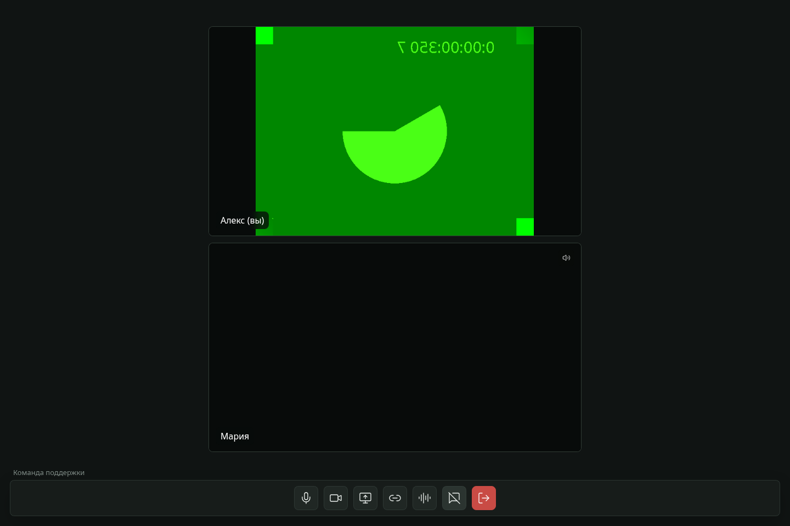
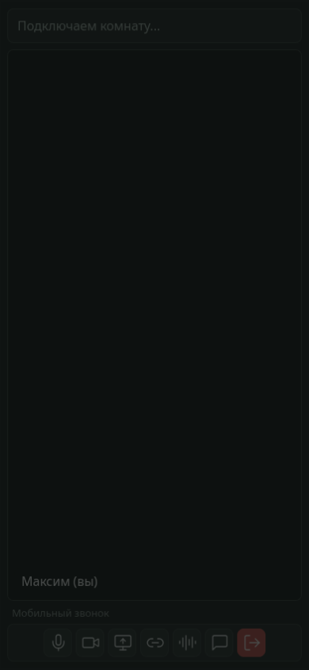

# Простецкий видеочат

Веб-приложение для видеозвонков в комнате до 4 участников. Клиент написан на React, сервер на Node.js + Express + Socket.io, медиа передается через WebRTC mesh.

## Скриншоты

### Создание комнаты



### Экран входа



### Комната на desktop



### Комната на телефоне



## Возможности

- создание комнаты с короткой ссылкой;
- prejoin-экран с preview камеры/микрофона;
- аудио и видео для 1-4 участников;
- включение/выключение камеры и микрофона без выхода из комнаты;
- демонстрация экрана, если браузер поддерживает `getDisplayMedia`;
- адаптивная раскладка для desktop и телефона;
- чат с историей на время жизни комнаты;
- перенос строки в чате через `Shift+Enter`, отправка через `Enter`;
- закрываемая панель чата;
- саундпад с аудиофайлами;
- индивидуальная громкость собеседников от `0` до `200`, по умолчанию `100`;
- отображение говорящего участника;
- TURN/STUN конфигурация через runtime endpoint `/rtc-config`.

## Требования

- Node.js 22+
- npm
- современный Chrome, Edge или Firefox
- HTTPS для работы камеры/микрофона вне `localhost`

## Локальный запуск

```bash
npm install
npm run dev:server
npm run dev:client
```

По умолчанию:

- клиент: `http://localhost:5173`
- сервер: `http://localhost:3001`
- health check: `http://localhost:3001/health`
- RTC config: `http://localhost:3001/rtc-config`

## Production-сборка

```bash
npm run build
npm run dev:server
```

Сервер отдает собранный клиент из `client/dist`.

## Docker

```bash
docker build -t fora-soft-video-chat:latest .
docker run -d \
  --name fora-soft-video-chat \
  -e PORT=3001 \
  -e CLIENT_ORIGIN="*" \
  -p 3017:3001 \
  fora-soft-video-chat:latest
```

## Переменные окружения

- `PORT` - порт Node.js сервера, по умолчанию `3001`.
- `CLIENT_ORIGIN` - CORS origin для Socket.io, по умолчанию `http://localhost:5173`.
- `ICE_SERVERS_JSON` - полный JSON-массив ICE servers. Имеет приоритет над TURN-переменными.
- `TURN_URL` - один или несколько TURN URL через запятую.
- `TURN_USERNAME` - username для TURN.
- `TURN_CREDENTIAL` - credential/password для TURN.

Пример TURN-конфигурации:

```bash
TURN_URL="turn:chat.tech-supp-test.ru:3478?transport=udp,turn:chat.tech-supp-test.ru:3478?transport=tcp"
TURN_USERNAME="videochat"
TURN_CREDENTIAL="secret"
```

Если TURN не задан, клиент использует только публичный STUN:

```json
[{ "urls": "stun:stun.l.google.com:19302" }]
```

## Скрипты

```bash
npm run dev:server   # Node.js server с watch mode
npm run dev:client   # Vite dev server
npm run build        # production build клиента
npm test             # unit tests server + client
npm run test:e2e     # Playwright smoke tests
```

## Архитектура

- `client/src/app/App.jsx` - простая маршрутизация `/` и `/room/:id`.
- `client/src/pages/LandingPage.jsx` - создание комнаты.
- `client/src/pages/PreJoinPage.jsx` - preview и вход в комнату.
- `client/src/pages/RoomPage.jsx` - orchestration комнаты.
- `client/src/hooks/useLocalMedia.js` - локальные media tracks, camera/mic/screen.
- `client/src/hooks/usePeerConnections.js` - WebRTC peer connections и renegotiation.
- `client/src/hooks/useSocketRoom.js` - Socket.io join/chat/signaling.
- `server/src/rooms/roomStore.js` - in-memory комнаты, участники, история чата.
- `server/src/sockets/socketHandlers.js` - Socket.io events.
- `server/src/index.js` - Express, static client, health и RTC config.

## Ограничения

- максимум 4 участника в комнате;
- WebRTC mesh без SFU, поэтому нагрузка растет с количеством участников;
- комнаты, участники и история чата хранятся только в памяти сервера;
- при рестарте сервера активные комнаты теряются;
- авторизация и роли отсутствуют;
- демонстрация экрана недоступна в браузерах без `navigator.mediaDevices.getDisplayMedia`.

## QA checklist

- создать комнату и проверить короткий URL;
- войти вторым участником по ссылке;
- проверить, что название комнаты видно всем участникам;
- проверить вход третьего и четвертого участника;
- проверить отказ пятому участнику с сообщением `Комната заполнена`;
- отправить сообщение в чат;
- проверить перенос строки через `Shift+Enter`;
- закрыть чат крестиком;
- выключить микрофон и проверить индикатор у остальных;
- выключить камеру и проверить заглушку без пропажи голоса;
- включить демонстрацию экрана на поддерживаемом браузере;
- проверить индивидуальную громкость собеседника;
- проверить саундпад;
- проверить мобильный prejoin и комнату;
- закрыть вкладку участника и проверить освобождение слота.
