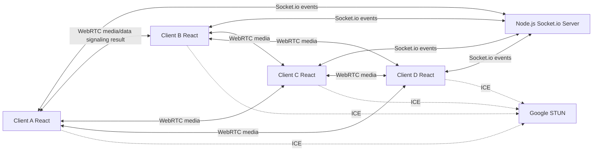
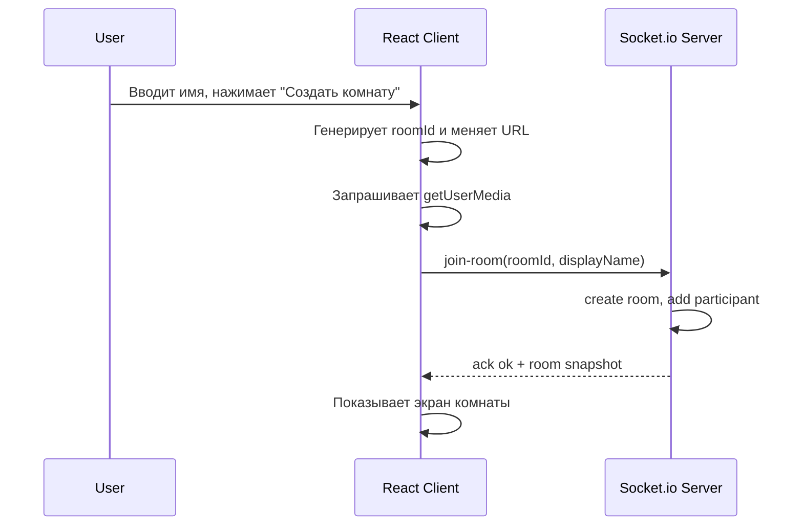
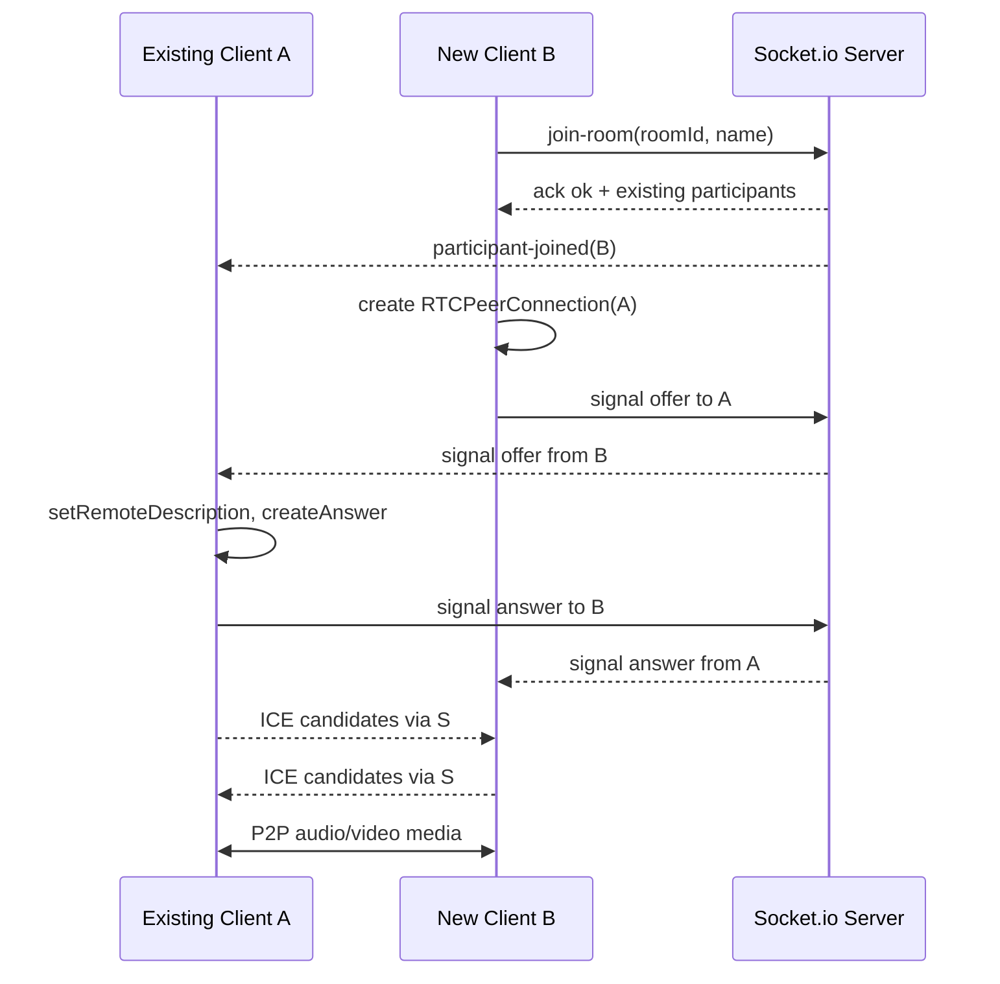

# Technical Design Document — Video Chat Room

## 1. Overview / Контекст

Цель фичи — реализовать веб-приложение видеочат-комнаты для группового звонка до 4 участников без регистрации. Пользователь вводит отображаемое имя, создаёт комнату или входит по ссылке, после чего получает видео/аудио через WebRTC и общий текстовый чат через Socket.io.

Источник требований: [artifacts/prd-video-chat-room.md](../../artifacts/prd-video-chat-room.md).

Ключевые ограничения из PRD:

- обязательный стек: JavaScript ES6+, Node.js, React, Socket.io, WebRTC;
- топология медиа: WebRTC mesh, без SFU и TURN;
- ICE: публичный STUN `stun.l.google.com`;
- состояние комнат, участников и чата хранится только в памяти сервера;
- нет авторизации, ролей, персистентного хранения и восстановления после перезагрузки;
- максимум 4 участника в комнате, проверка лимита выполняется на сервере атомарно;
- интерфейс только на русском, целевой desktop viewport от 1024px;
- `getUserMedia` требует HTTPS или `localhost`.

## 2. Current Architecture & Codebase Summary

В репозитории на момент подготовки TDD отсутствует прикладной код. Доступны только документы:

| Путь | Назначение | Вывод для дизайна |
| --- | --- | --- |
| `artifacts/prd-video-chat-room.md` | Финальный PRD фичи | Основной источник функциональных и технических требований. |
| `artifacts/prd-design.mdc` | Правило генерации TDD | Задаёт структуру текущего документа. |
| `artifacts/prd-tasks.mdc` | Правило генерации implementation plan | Может использоваться после утверждения TDD. |

TBD: если кодовая база будет добавлена позже, нужно пересмотреть разделы 2-6 и привязать компоненты к фактическим файлам, фреймворку сборки и существующим соглашениям.

Рекомендуемая стартовая структура проекта:

```text
server/
  package.json
  src/
    index.js
    rooms/roomStore.js
    rooms/roomService.js
    sockets/socketHandlers.js
    validation/sanitize.js
client/
  package.json
  src/
    app/App.jsx
    pages/LandingPage.jsx
    pages/RoomPage.jsx
    components/VideoGrid.jsx
    components/ParticipantTile.jsx
    components/ChatPanel.jsx
    components/ControlsBar.jsx
    hooks/useSocketRoom.js
    hooks/useLocalMedia.js
    hooks/usePeerConnections.js
    utils/validation.js
```

## 3. Proposed Architecture / High-Level Design

Система состоит из React-клиента и Node.js Socket.io-сервера. Сервер не передаёт медиа, а только координирует комнаты, участников, чат и WebRTC-сигналинг. Клиенты устанавливают прямые `RTCPeerConnection` друг с другом по mesh-топологии.



Основные архитектурные решения:

- Комната создаётся на `join-room`, если `roomId` отсутствует в памяти.
- Socket.io `socket.id` используется как внутренний `participantId`.
- Один браузер в двух вкладках создаёт два разных socket-соединения и занимает два слота.
- История чата хранится в массиве комнаты и отправляется новому участнику при входе.
- Для WebRTC применяется детерминированный порядок офферов: новый участник инициирует `offer` ко всем уже существующим участникам. Это снижает риск glare-ситуаций.
- Сервер валидирует имя, лимит участников и размер сообщений независимо от клиента.

## 4. Components & Interfaces

### Server: `roomStore`

Ответственность:

- хранить `Map<roomId, RoomState>` в памяти;
- создавать комнату при первом входе;
- удалять комнату после выхода последнего участника;
- выполнять атомарную проверку лимита участников в пределах одного Node.js event loop tick.

Интерфейс:

```js
createOrJoinRoom({ roomId, socketId, displayName })
leaveRoom({ socketId })
getRoom(roomId)
appendMessage({ roomId, message })
updateParticipantMedia({ socketId, audioEnabled, videoEnabled })
```

### Server: `socketHandlers`

Ответственность:

- регистрировать Socket.io события;
- маршрутизировать signaling-события адресно между участниками;
- рассылать список участников, чат и системные события;
- чистить состояние на `disconnect`.

### Client: `useSocketRoom`

Ответственность:

- подключаться к Socket.io серверу;
- отправлять `join-room`, `leave-room`, `chat-message`, `media-state`;
- принимать room snapshot, participant updates, chat events, signaling events;
- отображать состояния `connecting`, `joined`, `room-full`, `server-error`.

### Client: `useLocalMedia`

Ответственность:

- проверять поддержку `navigator.mediaDevices.getUserMedia`;
- запрашивать аудио и видео при входе;
- позволять вход без устройств или при отказе в доступе;
- выключать микрофон через `MediaStreamTrack.enabled = false`;
- выключать камеру через `track.stop()` и удаление/замену video track во всех peer connections;
- включать камеру повторным `getUserMedia({ video: true })`.

### Client: `usePeerConnections`

Ответственность:

- держать `Map<participantId, RTCPeerConnection>`;
- добавлять локальные tracks в каждое соединение;
- создавать offer для существующих участников после входа;
- обрабатывать answer и ICE candidates;
- принимать remote tracks и отдавать их в `VideoGrid`;
- закрывать соединения при выходе участника.

### Client UI

- `LandingPage`: ввод имени, создание комнаты, переход в комнату.
- `RoomPage`: оркестрация socket, media, peer connections и layout.
- `VideoGrid`: адаптивная сетка 1-4 плитки.
- `ParticipantTile`: video/placeholder, имя, иконки mute/camera off.
- `ControlsBar`: микрофон, камера, копирование ссылки, выход.
- `ChatPanel`: список сообщений, ввод, авто-прокрутка, список участников.

## 5. Data Model & DB Changes

База данных не требуется. Все данные живут в памяти Node.js процесса.

```js
RoomState = {
  id: string,
  createdAt: number,
  participants: Map<string, ParticipantState>,
  messages: ChatMessage[]
}

ParticipantState = {
  id: string,
  socketId: string,
  displayName: string,
  joinedAt: number,
  audioEnabled: boolean,
  videoEnabled: boolean
}

ChatMessage = {
  id: string,
  type: "user" | "system",
  roomId: string,
  senderId: string | null,
  senderName: string | null,
  text: string,
  createdAt: number
}
```

Миграции не нужны.

Ограничения модели:

- `roomId`: URL-safe строка, генерируется клиентом или сервером, рекомендуемо UUID/nanoid 10-16 символов.
- `displayName`: trim, 1-30 символов, допустимы буквы, цифры, пробел, дефис, подчёркивание; всё отображение выполняется через React text nodes, без `dangerouslySetInnerHTML`.
- `ChatMessage.text`: trim, непустое, рекомендуемый лимит 1000 символов.
- `messages`: хранить за время жизни комнаты; при удалении комнаты массив уничтожается.

## 6. API / Contracts

REST API не требуется, кроме отдачи клиентского приложения. Основной контракт — Socket.io events.

### Client -> Server

`join-room`

```json
{
  "roomId": "abc123",
  "displayName": "Алекс"
}
```

Ответ через ack:

```json
{
  "ok": true,
  "participantId": "socket-id",
  "room": {
    "id": "abc123",
    "participants": [],
    "messages": []
  }
}
```

Ошибка:

```json
{
  "ok": false,
  "code": "ROOM_FULL",
  "message": "Комната заполнена"
}
```

`signal`

```json
{
  "roomId": "abc123",
  "to": "participant-id",
  "type": "offer",
  "payload": {}
}
```

Допустимые `type`: `offer`, `answer`, `ice-candidate`.

`chat-message`

```json
{
  "roomId": "abc123",
  "text": "Привет"
}
```

`media-state`

```json
{
  "roomId": "abc123",
  "audioEnabled": true,
  "videoEnabled": false
}
```

`leave-room`

```json
{
  "roomId": "abc123"
}
```

### Server -> Client

- `participant-joined`: новый участник и актуальный список.
- `participant-left`: вышедший участник и актуальный список.
- `participants-updated`: полный snapshot участников.
- `chat-message`: user/system сообщение.
- `signal`: адресное WebRTC signaling сообщение.
- `room-closed`: опционально для локального выхода последнего участника.

Коды ошибок:

| Код | Когда возникает | UI-поведение |
| --- | --- | --- |
| `VALIDATION_ERROR` | Невалидное имя, roomId или сообщение | Показать текст рядом с формой/инпутом. |
| `ROOM_FULL` | В комнате уже 4 участника | Показать «Комната заполнена» и кнопку повторить вход. |
| `NOT_IN_ROOM` | Событие отправлено до успешного входа | Вернуть пользователя к экрану входа в комнату. |
| `TARGET_NOT_FOUND` | Адресат signaling уже вышел | Игнорировать на клиенте, закрыть peer connection. |
| `SERVER_ERROR` | Непредвиденная ошибка | Показать понятное сообщение о сервере. |

## 7. Data & Control Flows

### Создание комнаты



### Вход нового участника и WebRTC handshake



### Выключение камеры

1. Пользователь нажимает кнопку камеры.
2. Клиент вызывает `stop()` у локального video track.
3. Для каждого `RTCRtpSender` с video track выполняется `replaceTrack(null)`.
4. Клиент отправляет `media-state` с `videoEnabled: false`.
5. Сервер обновляет участника и рассылает `participants-updated`.
6. Остальные клиенты показывают заглушку на плитке участника.

### Выход или disconnect

1. Клиент отправляет `leave-room` или закрывает вкладку.
2. Сервер обрабатывает `leave-room`/`disconnect`.
3. Участник удаляется из `participants`.
4. В чат добавляется системное сообщение «<имя> покинул комнату».
5. Остальным отправляются `participant-left`, `chat-message`, `participants-updated`.
6. Если участников не осталось, сервер удаляет `RoomState`.

## 8. Error Handling & Edge Cases

- Пустое имя: блокировать вход на клиенте и сервере.
- Имя длиннее 30 символов: обрезать или отклонять на клиенте; сервер применяет финальную нормализацию.
- Спецсимволы/HTML в имени и сообщении: не исполнять, отображать только как текст.
- Пятый участник: сервер возвращает `ROOM_FULL`, socket не присоединяется к Socket.io room.
- Гонка за последний слот: `join-room` проверяет `participants.size` и добавляет участника синхронно в одном обработчике.
- Нет камеры/микрофона: вход разрешён, соответствующий `audioEnabled`/`videoEnabled` выставляется в `false`.
- Отказ в доступе к устройствам: показать сообщение, вход разрешён без треков.
- Потеря устройства: обработать `track.onended`, обновить media-state и показать заглушку.
- Socket сервер недоступен: показать экран ошибки подключения и действие повторной попытки.
- WebRTC не поддерживается: показать сообщение до входа в комнату.
- STUN недоступен или peer connection failed: показать локальный статус проблемного участника; чат и остальные соединения продолжают работать.
- Autoplay blocked: показывать кнопку «Включить звук» для запуска remote media после пользовательского жеста.
- Перезагрузка страницы: состояние не восстанавливается, пользователь снова вводит имя.
- Несколько вкладок: каждая вкладка получает отдельный socket id и занимает отдельный слот.

## 9. Performance & Scalability

Целевые параметры:

- максимум 4 участника на комнату;
- задержка аудио/видео в локальной сети до 500 мс;
- не более 6 peer-to-peer соединений на комнату;
- сервер не обрабатывает медиа, только signaling и чат.

Ограничения:

- WebRTC mesh плохо масштабируется выше 4 участников, поэтому лимит нельзя повышать без перехода на SFU;
- in-memory state не переживает рестарт сервера и не масштабируется горизонтально без sticky sessions и внешнего хранилища;
- TURN отсутствует, поэтому часть соединений за строгим NAT может не установиться.

Рекомендуемые практики:

- не хранить неограниченную историю сообщений, даже в памяти; лимит 200-500 сообщений на комнату достаточен для тестовой версии;
- ограничить частоту сообщений, например 5 сообщений за 5 секунд на socket;
- логировать только технические события без содержимого медиа.

## 10. Security & Compliance

- AuthN/AuthZ отсутствуют по требованиям PRD; доступ к комнате по идентификатору считается штатным.
- Использовать криптографически устойчивый генератор `roomId`, чтобы случайное угадывание было маловероятным, хотя не запрещённым.
- Все пользовательские строки валидировать на клиенте и сервере.
- В React отображать пользовательский ввод как text content, не использовать HTML-инъекции.
- Для Socket.io включить CORS только для доменов приложения в production.
- HTTPS обязателен вне `localhost`.
- WebRTC по умолчанию использует DTLS-SRTP; отдельное E2E-шифрование сверх этого не реализуется.
- PII минимальна: display name и ephemeral socket id. Долговременное хранение отсутствует.

## 11. Testing Strategy

### Unit tests

- server validation: имя, roomId, пустые сообщения, лимиты длины;
- roomStore: создание комнаты, вход 1-4 участников, отказ 5-му, удаление последнего участника;
- roomService: системные сообщения, история чата, media-state updates;
- client validation utils: имя и сообщение;
- hooks с mock WebRTC/Socket.io там, где возможно.

### Integration tests

- Socket.io join flow: новая комната, существующая комната, заполненная комната;
- chat flow: отправка, история для позднего участника, system join/leave;
- signaling routing: offer/answer/ice доставляются только указанному адресату;
- disconnect cleanup: слот освобождается, room удаляется при последнем участнике.

### E2E tests

Использовать Playwright с несколькими browser contexts:

- создание комнаты и копирование ссылки;
- вход второго, третьего и четвёртого участника;
- отказ пятому;
- отправка сообщения и авто-прокрутка;
- выключение микрофона и камеры с проверкой UI-индикаторов;
- закрытие вкладки и исчезновение участника у остальных;
- отказ в доступе к камере/микрофону через browser permissions.

### Manual QA

- реальные Chrome/Firefox/Edge 100+;
- localhost и HTTPS окружение;
- проверка физического выключения камеры при toggle off;
- проверка задержки в локальной сети;
- проверка сценария STUN/ICE failure, если доступна сеть со строгим NAT.

## 12. Deployment & Migration Plan

Миграций БД нет.

Рекомендуемый deployment:

1. Собрать React SPA.
2. Запустить Node.js сервер, который отдаёт static client build и Socket.io endpoint.
3. Настроить HTTPS на reverse proxy или hosting platform.
4. Настроить Socket.io path, CORS и proxy upgrade для WebSocket.
5. Проверить `getUserMedia` в production domain.
6. Выполнить smoke-test: create room, second participant join, chat, mic/camera toggles, leave.

Rollback:

- так как state in-memory, rollback равен перезапуску предыдущей версии;
- активные комнаты при рестарте будут потеряны, что допустимо для текущего объёма, но должно быть учтено при деплое.

Feature flags не обязательны. Если проект будет добавлен в существующее приложение, фичу стоит закрыть route-level flag до завершения QA.

## 13. Risks & Mitigations

| Риск | Влияние | Митигация |
| --- | --- | --- |
| В репозитории нет текущего приложения | Нельзя точно привязать TDD к существующим файлам | После добавления кода пересмотреть раздел 2 и структуру компонентов. |
| Mesh WebRTC нестабилен у части пользователей за NAT | Отдельные пары участников могут не видеть/слышать друг друга | Явно показывать ошибку соединения; TURN остаётся out of scope по PRD. |
| Повышение лимита выше 4 | Резко растёт число соединений и нагрузка на клиентов | Зафиксировать серверный лимит 4; для расширения проектировать SFU отдельно. |
| Рестарт сервера удаляет комнаты | Активные звонки прерываются | Для тестовой версии допустимо; production потребует graceful deploy или внешнее состояние. |
| Камера не освобождается при неправильном toggle | Не выполняется важный acceptance criterion | Использовать `track.stop()` и `replaceTrack(null)`, покрыть manual QA. |
| XSS через чат/имя | Компрометация клиентов комнаты | Не использовать HTML rendering; серверная нормализация и клиентское экранирование. |
| Browser autoplay | Удалённое аудио может не стартовать | Добавить пользовательский жест входа/кнопку «Включить звук». |

## 14. Open Questions / TBD

- TBD: какая фактическая структура проекта будет использоваться: monorepo с `client/` и `server/`, единый Node-проект или другой шаблон сборки.
- TBD: пакетный менеджер: npm, yarn или pnpm.
- TBD: конкретный bundler для React: Vite, Create React App, Next.js без SSR или другой вариант.
- TBD: production hosting и способ терминации HTTPS.
- TBD: допустимый лимит длины чат-сообщения и антифлуд-порог. Рекомендуемое значение: 1000 символов и 5 сообщений за 5 секунд.
- TBD: нужен ли отдельный health endpoint для мониторинга Socket.io сервера.
- TBD: нужно ли сохранять технические логи входа/выхода на диск или достаточно stdout.
